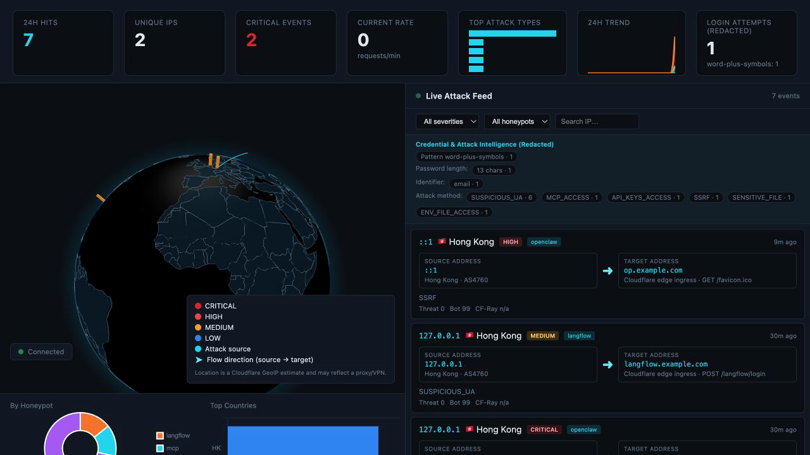
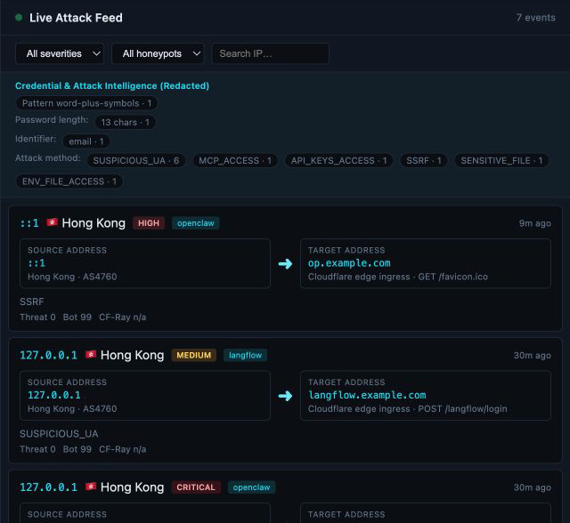
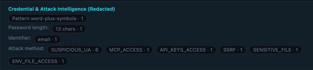
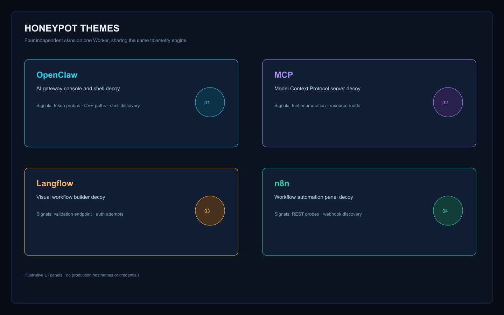

# Workers Honeypot

Workers Honeypot は Cloudflare Workers と D1 で動作する多テーマ honeypot です。防御的なセキュリティ研究、攻撃テレメトリ、認証情報パターン分析、リアルタイム脅威可視化を目的とします。

[English](README.md) · [中文](README.zh-CN.md) · [Español](README.es.md) · [한국어](README.ko.md) · [Português](README.pt-BR.md)


> 研究用途のみ。おとりデータはすべて合成データです。実際の認証情報を収集しないでください。

## 主な機能

- OpenClaw、MCP、Langflow、n8n のおとり画面
- Cloudflare Worker と D1 によるログ保存
- WebGL の脅威地球儀とアニメーション攻撃アーク
- 送信元 IP、GeoIP 都市/国、ASN、対象ホスト、メソッド、パス、重大度
- パスワードの長さ・パターン・識別子種別の集計
- 200 以上の攻撃検出パターン

## スクリーンショットと構成

### オペレーションコンソール

ライブコンソールは WebGL 脅威地球儀、送信元から対象へのアーク、トレンドカード、イベントフィードを一つの画面にまとめます。

<p align="center"></p>

### ライブ攻撃フィード

各イベントカードには送信元アドレス、対象となったハニーポット、メソッドとパス、重大度、Threat Score、Bot Score が表示されます。データはローカルの合成テレメトリです。

<p align="center"></p>

### 認証情報・攻撃インテリジェンス

パスワードのパターン・長さ、識別子種別、攻撃メソッドを集計表示します。平文パスワードは保存も表示もしません。

<p align="center"></p>

### ハニーポットテーマ

4 つのデコイスキンは同じテレメトリエンジンを共有し、OpenClaw、MCP、Langflow、n8n の画面を提供します。

<p align="center"></p>

リクエストは 4 つのスキンに振り分けられ、共通アナライザーが D1 に保存し、保護された Admin API が地球儀・Feed・認証情報集計を表示します。

### Cloudflare Deploy Button

最短で試すには Cloudflare Workers を利用できます。まず Fork して、公式ボタンからデプロイを開始してください。

[](https://deploy.workers.cloudflare.com/?url=https://github.com/stephenlzc/workers-honeypot)

ボタンは Worker のデプロイフローを開始しますが、D1 と `ADMIN_PASSWORD` Secret は Fork 側で承認・設定する必要があります。

```bash
git clone https://github.com/stephenlzc/workers-honeypot.git
cd workers-honeypot
npm ci
npm run setup:cloudflare
```

セットアップでは D1 の作成、スキーマ適用、`ADMIN_PASSWORD` Secret の設定、デプロイを行います。パスワードはファイルに保存されません。

## 安全性

おとりのキー、トークン、ファイル、ユーザーは架空です。パスワードの平文は保存せず、識別子ハッシュ、長さ、パターンラベルのみ保持します。

デフォルトの管理者パスワードはありません。`npx wrangler secret put ADMIN_PASSWORD` を実行してください。Deploy Button は Worker のみを自動化し、D1 と Secret は利用者の承認が必要です。
