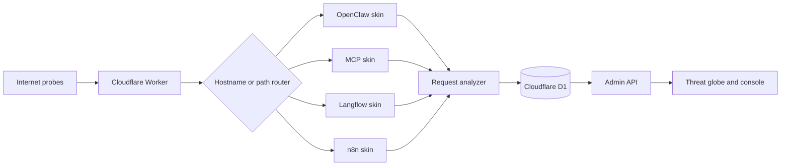

<p align="center">
  
</p>

<h1 align="center">Workers Honeypot</h1>

<p align="center">
  A multi-skin honeypot on Cloudflare Workers for defensive security research, attack telemetry, credential-pattern analytics, and live threat visualization.
</p>

<p align="center">
  <a href="https://github.com/stephenlzc/workers-honeypot/fork">Fork</a> ·
  <a href="https://deploy.workers.cloudflare.com/?url=https://github.com/stephenlzc/workers-honeypot">Deploy to Cloudflare</a> ·
  <a href="README.zh-CN.md">中文</a> ·
  <a href="README.es.md">Español</a> ·
  <a href="README.ja.md">日本語</a> ·
  <a href="README.ko.md">한국어</a> ·
  <a href="README.pt-BR.md">Português</a>
</p>

> **Research-only project.** The decoy data is synthetic. Do not deploy this service on a production hostname or use it to collect real credentials.

## What it does

Workers Honeypot presents realistic decoy interfaces for four commonly targeted automation surfaces:

| Skin | Decoy surface | Example telemetry |
| --- | --- | --- |
| OpenClaw | AI gateway console and shell | token theft, path traversal, command probes |
| MCP | Model Context Protocol server | tool discovery and unsafe tool calls |
| Langflow | LLM workflow panel | CVE-2025-3248 validation probes and login attempts |
| n8n | Workflow automation panel | REST discovery, webhook and login probes |

Every request is classified and stored in Cloudflare D1. The operations console provides a globe view, source-to-target flows, live event feed, attack trends, and credential-pattern aggregates. Passwords are never stored in plaintext.

## Screenshots

Example screenshots use synthetic or redacted telemetry and do not represent a global threat-intelligence feed.

### Operations console

The live console combines the WebGL threat globe, animated source-to-target arcs, trend cards, and the event stream in one view.

<p align="center"></p>

### Live attack feed

Each event card shows the observed source address, the selected honeypot target, request method and path, severity, threat score, and bot score. The example uses local synthetic telemetry.

<p align="center"></p>

### Credential and attack intelligence

This panel reports aggregate password-pattern, password-length, identifier-type, and attack-method counts. Plaintext passwords are never retained or displayed.

<p align="center"></p>

### Honeypot themes

The four decoy skins share one telemetry engine while presenting distinct OpenClaw, MCP, Langflow, and n8n surfaces.

<p align="center"></p>

## Architecture



## Highlights

- Cloudflare Workers runtime with D1 as the only persistent store
- No build framework and no paid Cloudflare features required
- WebGL globe with simplified country borders and animated attack arcs
- Real-time feed with source IP, GeoIP city/country, ASN, target hostname, method, path, severity, and Cloudflare metadata
- Credential intelligence that stores only identifier hashes, password length, and pattern labels
- 200+ detection patterns across web, CMS, container, IoT, Kubernetes, and OpenClaw probes
- Optional WAF feedback loop with dry-run support
- Session-protected Admin console and configurable `ADMIN_PASSWORD` Secret

## Quick start

### Fork and run the guided setup

```bash
git clone https://github.com/stephenlzc/workers-honeypot.git
cd workers-honeypot
npm ci
npm run setup:cloudflare
```

The setup command checks Wrangler authentication, creates or reuses the `workers-honeypot` D1 database, applies `schema.sql`, prompts for your Admin password, and deploys the Worker. It never writes the password to a file.

### Manual setup

```bash
npx wrangler login
npx wrangler d1 create workers-honeypot
# Put the returned ID in wrangler.toml
npx wrangler d1 execute workers-honeypot --remote --file=schema.sql
npx wrangler secret put ADMIN_PASSWORD
npm run deploy
```

The public configuration uses `YOUR_D1_DATABASE_ID`. Replace it with a database owned by your account. Custom-domain routes are optional; the default `workers.dev` URL is safer for initial testing.

### Cloudflare Deploy Button

Cloudflare Workers is the fastest way to try this project. Use the official button to start a deployment from your own Fork:

[](https://deploy.workers.cloudflare.com/?url=https://github.com/stephenlzc/workers-honeypot)

The button starts the Worker deployment flow, but it cannot safely create a D1 database or an Admin Secret without your authorization. Fork first, then finish the guided setup and configure `ADMIN_PASSWORD`.

### GitHub Actions deployment

Enable `.github/workflows/deploy.yml` in your Fork and add these repository secrets:

- `CLOUDFLARE_API_TOKEN`
- `CLOUDFLARE_ACCOUNT_ID`
- `CLOUDFLARE_D1_DATABASE_ID`
- `ADMIN_PASSWORD`

The workflow applies the schema and deploys without printing secrets. Do not place secrets in YAML, source files, or commit messages.

## Admin console

After deployment, open `/admin` on your Worker URL and sign in with the password you configured. The console is English-only and includes:

- WebGL globe and animated source-to-target attack flows
- Live event feed with filtering by severity, honeypot, and IP
- Attack-type, country, honeypot, and hourly trend charts
- Credential-pattern, password-length, and identifier-type aggregates
- Event details, request metadata, and manual IP blocking

GeoIP is an approximation and may identify a proxy, VPN, cloud provider, or egress point rather than the human operator.

## Configuration

| Variable / Secret | Purpose |
| --- | --- |
| `ENVIRONMENT` | Runtime environment label |
| `ADMIN_PASSWORD` | Required Admin login Secret |
| `CLOUDFLARE_API_TOKEN` | Optional WAF feedback-loop token |

Never reuse a production password as `ADMIN_PASSWORD`. Rotate it from the Cloudflare dashboard or Wrangler if it is exposed.

## Local development

```bash
printf '%s\n' 'ADMIN_PASSWORD=choose-a-local-test-password' > .dev.vars
npm run db:init:local
npm run dev
```

`.dev.vars` is ignored by Git. Use only synthetic traffic and test data locally.

## Data and safety model

- Decoy API keys, tokens, files, users, and database records are fabricated.
- Incoming payloads are analyzed and stored only for defensive research.
- Login telemetry keeps identifier hashes plus password length and pattern labels; plaintext passwords are discarded.
- The Worker never executes attacker commands, evaluates submitted code, or forwards attack payloads to third parties.
- WAF automation is disabled by default and must be reviewed before enabling.

## Project layout

```text
src/
  core/                 analysis, database, utilities, WAF integration
  dashboard/            Admin API and WebGL operations console
  skins/                OpenClaw, MCP, Langflow, and n8n decoys
schema.sql              D1 schema
scripts/setup-cloudflare.mjs  guided account setup
wrangler.toml           local deployment configuration
wrangler.example.toml   safe configuration template
```

## Limitations

This project reports observations from your own honeypot deployment. It is not a replacement for a commercial threat-intelligence platform, an attribution system, or a real network-route tracer. Coordinates are Cloudflare GeoIP estimates and target nodes are visualization endpoints.

## Acknowledgements

This project is built on and informed by the following open-source projects, platforms, visual references, and public research:

- [OpenClaw Honey-Pot](https://github.com/inwpu/openclaw-Honey-Pot) — upstream Worker, OpenClaw decoy surface, shell simulation, schema, and initial Admin flow.
- [hono-honeypot](https://github.com/ph33nx/hono-honeypot) — source of adapted attack-detection patterns used by the analyzer.
- [kumogakure](https://github.com/turntuptechnologies-ai/kumogakure), [HoneyPot](https://github.com/Jack-Rolls/HoneyPot), and [workers-tarpit](https://github.com/crumrine/workers-tarpit) — architecture and honeypot design references.
- [Kaspersky Cybermap](https://cybermap.kaspersky.com/) and [FortiGuard Threat Map](https://fortiguard.fortinet.com/threat-map) — visual references for the threat globe and attack-flow presentation.
- [globe.gl](https://github.com/vasturiano/globe.gl), [world-atlas](https://github.com/topojson/world-atlas), [topojson-client](https://github.com/topojson/topojson-client), and [Chart.js](https://github.com/chartjs/Chart.js) — open-source visualization libraries used by the console.
- [Cloudflare Workers](https://developers.cloudflare.com/workers/), [D1](https://developers.cloudflare.com/d1/), and [Wrangler](https://developers.cloudflare.com/workers/wrangler/) — runtime, storage, and deployment tooling.
- OpenClaw, MCP/MCPwn, Langflow, n8n, and Open WebUI documentation, together with public security research from Rapid7, SentinelOne, arXiv, Practical DevSecOps, Sysdig, Cato, Sangfor, and secrss — threat-modeling context for the decoy surfaces and detection rules.

These sources are credited for code lineage, tooling, design inspiration, or research context as noted above. This project is not affiliated with or endorsed by them.

## License and responsible use

Review the license and applicable laws before deployment. Use this project only on infrastructure you own or are authorized to monitor. Keep the honeypot isolated from production systems and review collected data under your organization’s privacy policy.

## Roadmap

- Add optional signed export bundles for incident review
- Improve globe clustering for high-volume deployments
- Add pluggable alert sinks that remain opt-in and privacy reviewed

See [GITHUB_METADATA.md](GITHUB_METADATA.md) for the suggested repository description and topics.
